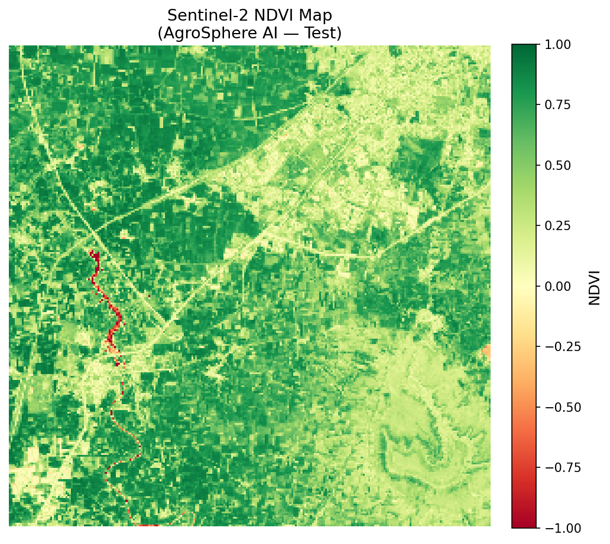

# 🌱 AgroSphere NDVI

> Satellite-powered crop health analysis and market prediction platform.

[](https://python.org)
[](https://flask.palletsprojects.com)
[](https://sentinel.esa.int)

---

## What It Does

AgroSphere NDVI fetches real Sentinel-2 satellite imagery for any location on Earth, computes the **NDVI (Normalized Difference Vegetation Index)**, and translates the raw data into:

- 🗺️ **Color-coded vegetation health map**
- 📊 **Plain-language crop stress insights**  
- 🎯 **4-step market prediction** (production → supply → price → SELL/HOLD recommendation)

---

## Screenshots

| Interactive Map | NDVI Results | Market Prediction |
|---|---|---|
|  | Color-coded vegetation map | Step-by-step SELL/HOLD logic |

---

## Project Structure

```
agrosphere-ndvi/
├── backend/
│   ├── app.py              # Flask API server
│   ├── ndvi_service.py     # Sentinel Hub integration + NDVI computation
│   └── coordinates.py      # Coordinate config (runtime-injected)
│
├── frontend/
│   ├── index.html          # Main UI
│   ├── style.css           # Styling
│   └── app.js              # Map interaction + results rendering
│
├── docs/
│   ├── HOW_TO_USE.md
│   ├── SENTINEL_API_DOCUMENTATION.md
│   ├── QUICK_START.md
│   ├── MARKET_PREDICTION_FEATURE.md
│   └── ... (complete documentation)
│
├── sample_output/
│   ├── ndvi_map.png         # Example NDVI visualization
│   └── ndvi_analysis.json   # Example JSON output
│
├── requirements.txt
├── Procfile                 # For Render / Railway deployment
└── README.md
```

---

## Quick Start

### 1. Clone & Install

```bash
git clone https://github.com/YOUR_USERNAME/agrosphere-ndvi.git
cd agrosphere-ndvi
pip install -r requirements.txt
```

### 2. Set Credentials

Get free credentials at [sentinel-hub.com](https://www.sentinel-hub.com/)

```bash
# Windows
set SENTINEL_CLIENT_ID=your-client-id
set SENTINEL_CLIENT_SECRET=your-client-secret

# Linux / Mac
export SENTINEL_CLIENT_ID=your-client-id
export SENTINEL_CLIENT_SECRET=your-client-secret
```

### 3. Run

```bash
python backend/app.py
```

Open [http://localhost:5000](http://localhost:5000)

---

## How It Works

```
User clicks map → Flask backend → Sentinel Hub API → NDVI computation → Market prediction → Results
```

1. **Click anywhere** on the world map
2. **Wait 10-30 seconds** for satellite data processing  
3. **View results:**
   - Color-coded NDVI map
   - Key insights in plain language
   - 4-step market prediction with SELL/HOLD recommendation

---

## NDVI Interpretation

| NDVI Range | Meaning | Map Color |
|---|---|---|
| -1.0 to 0.2 | Bare soil, water, urban | 🔴 Red |
| 0.2 to 0.6 | Sparse or stressed vegetation | 🟡 Yellow |
| 0.6 to 1.0 | Healthy, dense vegetation | 🟢 Green |

---

## Market Prediction Logic

The system uses a 4-step economic chain:

1. **🧠 Production Analysis** — NDVI rules classify yield as HIGH/MODERATE/LOW
2. **📉 Supply Impact** — Low production → supply shortage in mandis  
3. **📈 Price Prediction** — Low supply + constant demand → prices rise
4. **🟡 Recommendation** — HOLD (wait to sell) or SELL NOW

### Example Output

For NDVI = 0.27, stressed = 84%:

> *"Because average NDVI is below 0.3 and more than 80% of crops are stressed, our system predicts a supply shortage — so prices will rise and farmers should wait before selling."*

---

## API Reference

### `POST /analyze`

**Request:**
```json
{
  "lat": 20.824867,
  "lon": 73.891525,
  "area_km": 10.0
}
```

**Response:**
```json
{
  "mean_ndvi": 0.2778,
  "vegetation_coverage_percentage": 85.5,
  "healthy_percentage": 1.2,
  "stressed_percentage": 84.4,
  "non_vegetated_percentage": 14.5,
  "timestamp": "2026-02-28T05:57:06Z",
  "location": { "lat": 20.824867, "lon": 73.891525, "area_km": 10.0 },
  "ndvi_map_url": "/ndvi_map.png"
}
```

---

## Deploy to Render (Free)

1. **Push to GitHub**
2. **Go to [render.com](https://render.com)** → New Web Service
3. **Connect your repo**
4. **Settings:**
   - Build command: `pip install -r requirements.txt`
   - Start command: `gunicorn --chdir backend app:app`
5. **Add environment variables:**
   - `SENTINEL_CLIENT_ID`
   - `SENTINEL_CLIENT_SECRET`
6. **Deploy** — live in ~3 minutes

---

## Tech Stack

| Component | Technology |
|---|---|
| Satellite Data | Sentinel-2 L2A via Sentinel Hub API |
| Backend | Python, Flask, Gunicorn |
| NDVI Processing | NumPy, Rasterio, Matplotlib |
| Frontend | HTML5, CSS3, Vanilla JS |
| Map | Leaflet.js + OpenStreetMap |
| Hosting | Render / Railway |

---

## Documentation

- 📖 **[Quick Start](docs/QUICK_START.md)** — 3-step setup
- 📖 **[How to Use](docs/HOW_TO_USE.md)** — User guide
- 📖 **[Market Prediction](docs/MARKET_PREDICTION_FEATURE.md)** — Logic explained
- 📖 **[API Documentation](docs/SENTINEL_API_DOCUMENTATION.md)** — Technical details

---

## Sample Output

**Key Insights:**
> From this region: Only 1.2% of the land is healthy. 84.4% of the crops are stressed. 14.5% is non-vegetated. So although 85.5% land has crops, most of those crops are under stress. ⚠️ This is extremely important.

**Market Recommendation:**
> ✅ DO NOT SELL NOW — WAIT for the price peak

---

## License

MIT — free to use, modify, and distribute.

---

## Built With ❤️

- [Sentinel Hub](https://www.sentinel-hub.com/) — satellite imagery API
- [Leaflet.js](https://leafletjs.com/) — interactive maps  
- [Flask](https://flask.palletsprojects.com/) — Python web framework
- [Rasterio](https://rasterio.readthedocs.io/) — geospatial processing